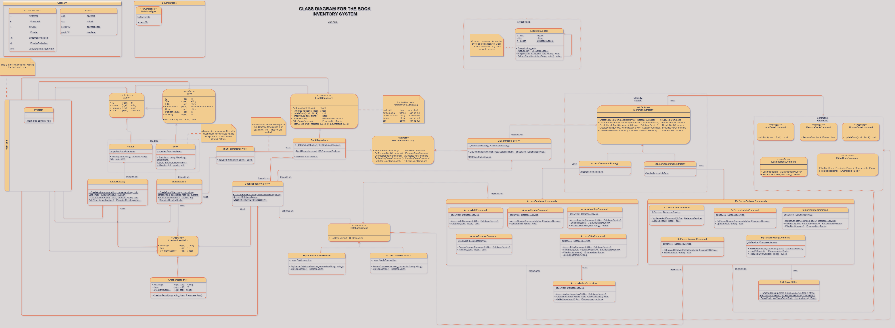
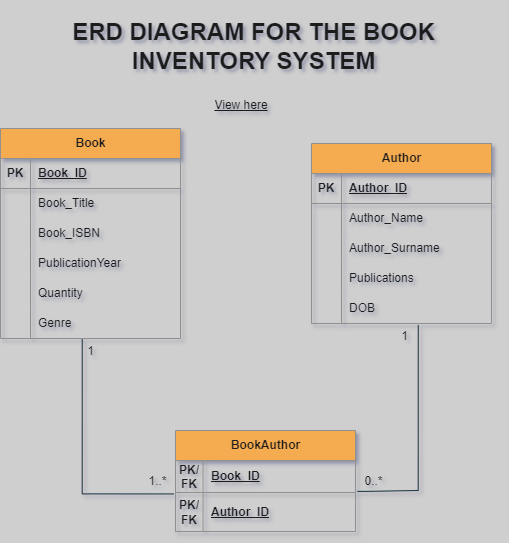

# Book-Inventory-System
## Table of Contents  
1. [Introduction](#introduction)  
2. [Features](#features)  
3. [System Architecture](#system-architecture)  
   - [High-Level Architecture Overview](#overview)  
   - [Class and ERD Diagram](#class-diagram)  
   - [Design Principles](#design-principles)  
4. [Database Setup](#database-setup)  
   - [Microsoft Access](#microsoft-access)  
   - [SQL Server](#sql-server)  
5. [Integration Guidelines](#integration-guidelines)  
   - [Adding References](#adding-references)  
   - [Configuration](#configuration)  
6. [Usage Instructions](#usage-instructions)  
   - [Adding Books](#adding-books)  
   - [Updating Books](#updating-books)  
   - [Removing Books](#removing-books)  
   - [Filtering Books](#filtering-books)  
   - [Finding Books by ISBN](#finding-books-by-isbn)  
7. [Development Practices](#development-practices)  
   - [Design Principles Followed](#design-principles-followed)  
   - [Data Structures Used](#data-structures-used)  
   - [OOP Pillars and Implementation](#oop-pillars-and-implementation)  
8. [Testing and Debugging](#testing-and-debugging)  
9. [Contributing](#contributing)  
10. [License](#license)  
11. [Contact Information](#contact-information)  

## Introduction  
The Book Inventory System is a robust backend library designed to manage book records in a database environment. It supports two database engines: Microsoft Access and SQL Server, providing seamless integration and flexibility for different user setups. This system handles core operations such as adding, updating, removing, and filtering books, while maintaining a clean separation of concerns through the use of design patterns like the Repository Pattern and Strategy Pattern.  

With a focus on maintainability, scalability, and performance, this system is ideal for developers seeking a well-architected solution for book inventory management in both small-scale and enterprise-level applications.  

---

## Features

1. **Multi-Database Support**  
   The system fully supports both Microsoft Access and SQL Server databases, allowing for flexible database engine selection.

2. **CRUD Operations**  
   Users can easily perform CRUD operations on books. This includes adding new books along with their associated authors, updating book details and authors, and removing books while maintaining the integrity of the author data. The system also provides functionality to retrieve books using flexible filtering criteria.

3. **Advanced Filtering**  
   The system offers advanced filtering capabilities. You can filter books by title, genre, author name, and author surname, either individually or in combination. Additionally, there is support for toggling between "match any" or "match all" filtering criteria, allowing for versatile query operations.

4. **ISBN Management**  
   ISBN strings are automatically formatted to ensure consistency and correctness, making sure that each ISBN follows the proper format, thus reducing potential data entry errors.

5. **Extensible Architecture**  
   The system has been designed with extensibility in mind. By implementing a command strategy interface, it is easy to add support for new database engines in the future without significant modifications to the existing codebase.

6. **Optimized Database Commands**  
   The system utilizes stored procedures, triggers, and functions to ensure efficient database operations in SQL Server. This optimizes performance and simplifies complex queries, reducing the need for excessive client-side logic.

7. **Error Logging**  
   A centralized error logging mechanism is in place, capturing any runtime issues effectively. This makes it easier to debug and troubleshoot errors that may occur during system operation.

8. **Test Data Ready**  
   Preloaded database scripts with test data are provided, enabling users to quickly get started with the system. This allows for easy testing and validation of the system's functionality.

9. **OOP and Design Principles**  
   The system adheres to key object-oriented principles such as encapsulation, abstraction, inheritance, and polymorphism. These principles are employed throughout the codebase to ensure a clean and maintainable structure. In addition, SOLID principles have been followed to ensure the code is scalable, flexible, and easy to maintain over time.

10. **Modular Design**  
    The system follows a modular design approach, where the client-side logic is cleanly separated from the database-side logic. This separation of concerns is achieved through the use of repository and command layers, abstracting away the details of the database operations and simplifying the client-side application.

---

## System Architecture  

The Book Inventory System is designed with a clear separation of concerns, using Object-Oriented Programming (OOP) principles and common design patterns. The architecture is built to be scalable, maintainable, and flexible to support different database engines (Access and SQL Server). Below is a breakdown of the components and the interaction between them.

### Overview  
The system is designed around a **Repository Pattern** for managing the interactions with the database. The **Command Pattern** is used to encapsulate database queries and operations. The system is divided into two primary layers:  
1. **Client Layer**: This represents the application layer that interacts with the user, gathers inputs, and uses the Book Repository to fetch or modify data.
2. **Backend Layer**: This includes the database, its queries, and the logic for interacting with it.

The **BookRepository** acts as the central hub for CRUD operations, with separate commands to handle different tasks. These tasks include adding books, updating books, filtering books based on various criteria, and removing books from the system. The commands are encapsulated in strategies that are determined by the database type (Access or SQL Server), making the system extendable.

The **Database Layer** consists of:
- **Stored Procedures**: For querying the database, ensuring that complex operations are executed efficiently at the database level.
- **Functions and Triggers**: Used for data integrity, such as updating the number of publications for authors when book-author relationships are changed.

### Key Components  
1. **Book Repository**: Handles the primary interactions with the data. It abstracts the complexity of database operations and provides a simple API for the client code.
2. **Commands**: Different commands (Add, Update, Delete, etc.) handle the actual database interaction, which are further split based on the database engine.
3. **Database Service**: Abstracts the connection to the database and handles opening and closing the connection.
4. **Factory Classes**: Provide a flexible and extendable mechanism to create instances of repositories, ensuring the correct command strategies are used based on the database type.

### Class Diagram  
The class diagram below illustrates the relationship between key classes and interfaces in the system.

  <!-- Ensure to replace this with the actual link to your class diagram file -->

### ERD (Entity-Relationship Diagram)  
The ERD diagram below demonstrates the relationships between the entities in the Book Inventory System, including the primary tables like `Book`, `Author`, and `BookAuthor`, as well as the connections between them.

  <!-- Ensure to replace this with the actual link to your ERD diagram file -->

### Interaction Flow  
1. The **client** requests a book operation (e.g., add, remove, filter).
2. The **Book Repository** processes the request by calling the appropriate **command** (e.g., AddBookCommand, RemoveBookCommand).
3. The **command** executes the corresponding **stored procedure** or **SQL query** using the **Database Service**.
4. The result is passed back to the client, which presents it to the user.

### Design Principles

The Book Inventory System is built with a strong focus on **maintainability**, **scalability**, and **flexibility**. The following design principles have been adhered to in order to create a robust architecture:

#### 1. **Separation of Concerns**
   - Each class and component in the system has a single responsibility. For example, the `BookRepository` is responsible for interacting with the data store (i.e., database) while the command classes (`AddBookCommand`, `FilterBooksCommand`, etc.) handle specific database operations. This promotes maintainability and easier debugging.
   
#### 2. **Dependency Injection**
   - The system uses dependency injection to decouple classes from their dependencies, such as database services and commands. This allows for better flexibility and testability. The `BookRepository` class, for instance, receives its dependencies (commands for adding, updating, and filtering books) through its constructor.
   
#### 3. **Command Pattern**
   - The **Command Pattern** is implemented to encapsulate each request as an object, thus allowing parameterization of clients with queues, requests, and operations. It also decouples the client from the system's internal workings, such as database interactions. 
     - For example, the command interface `IAddBookCommand` is used for adding books, and different implementations are provided based on the database type (`AccessAddCommand`, `SQLServerAddCommand`).

#### 4. **Strategy Pattern**
   - The **Strategy Pattern** is used in the `DBCommandFactory`, which selects the appropriate command strategy (`AccessCommandStrategy` or `SQLServerCommandStrategy`) based on the database type. This approach enhances flexibility by decoupling the logic for command creation, making it easy to extend the system to support additional databases in the future without modifying existing code.

#### 5. **Interface Segregation**
   - The system uses small, client-specific interfaces. For instance, the `IBookRepository` interface defines methods like `AddBook`, `RemoveBook`, and `FilterBooks`, which are implemented in the `BookRepository`. Each class only depends on the methods it needs, reducing unnecessary coupling.

#### 6. **Single Responsibility Principle (SRP)**
   - Each class in the system is designed to have one reason to change. For example, the `BookRepository` class handles the logic for interacting with books, but it delegates database-specific operations to the command classes. The database interaction logic is contained within these command classes, adhering to SRP.

#### 7. **Open/Closed Principle**
   - The system is open for extension but closed for modification. New features or database engines can be added without modifying existing code, thanks to the Strategy Pattern and dependency injection. Adding support for a new database type, for instance, only requires the addition of a new command strategy without altering the existing repository logic.

#### 8. **Data Consistency**
   - Data consistency is ensured by transactional database operations (e.g., in commands such as `AddBook` and `RemoveBook`). This ensures that if any part of the operation fails, changes to the data are rolled back, leaving the database in a consistent state.

#### 9. **Error Handling**
   - The system uses centralized error handling, especially in database interactions, where all exceptions are logged and rethrown as custom exceptions. This allows for better tracking of errors and keeps the database interaction layer clean and consistent.

---

This architecture ensures that the system remains modular and easy to extend. Future database engines can be added by creating new command strategies without changing the core logic. Similarly, changes in the database operations can be encapsulated within the command layer, keeping the repository layer unaffected.
